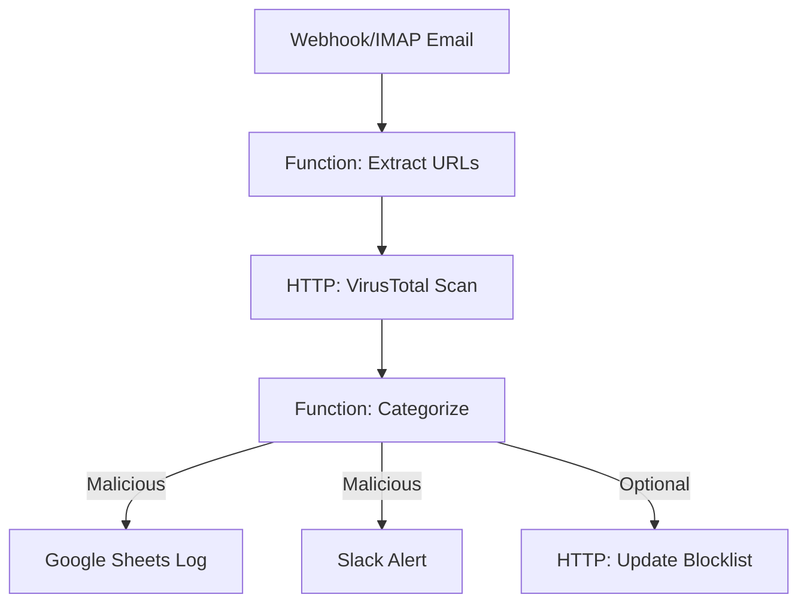

```mermaid
graph TD
  Trigger["Webhook/IMAP Email"] --> Extract["Function: Extract URLs"]
  Extract --> Scan["HTTP: VirusTotal Scan"]
  Scan --> Categorize["Function: Categorize"]
  Categorize -->|"Malicious"| Sheets["Google Sheets Log"]
  Categorize -->|"Malicious"| Slack["Slack Alert"]
  Categorize -->|"Optional"| Blocklist["HTTP: Update Blocklist"]
```
